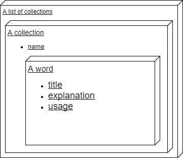
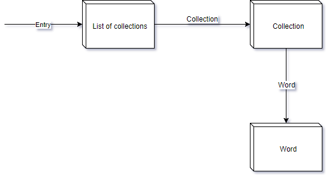
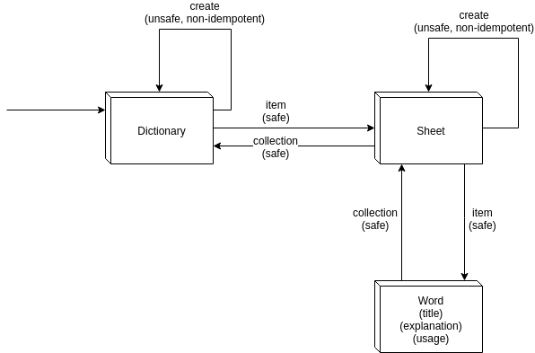

# api-words-demo

## Seven-Step Design Procedure
1. List semantic descriptors
2. Draw a State Diagram and determite link relations
3. Reconcile application semantics with existing profiles
4. Choose a media type
5. Write a profile
6. Implement HTTP server
7. Publish a entry url

### 1. List the Semantic Descriptors
Here are all the pieces of data for a custom foreign vocabulary:
* A dictionary
* A sheet
* The name of a sheet
* A word
* The name of a word
* The explanation of a word
* The usage example of a word

Dividing the descriptors into representations

### 2. Draw a State Diagram
A simple basic state diagram of the resources and their link relations

### 3. Reconcile Names
The schema.org does not offer suitable data type. Therefore all the semantic descriptors will be described in a profile.

### 4. Choose a Media Type
The [Collection+JSON](https://github.com/collection-json/spec) is a JSON-based read/write hypermedia-type designed to support management and querying of simple collections.

### 5. Write a Profile
    TODO
### 6. Implement HTTP-server